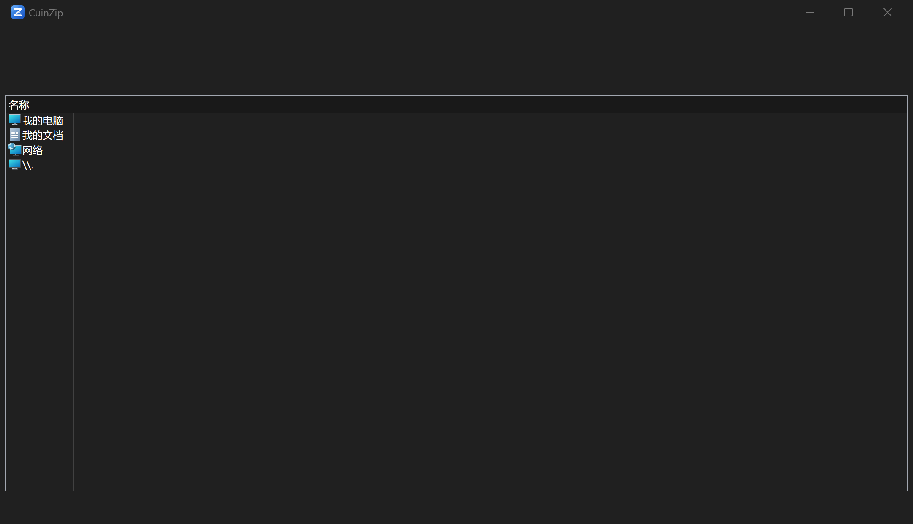
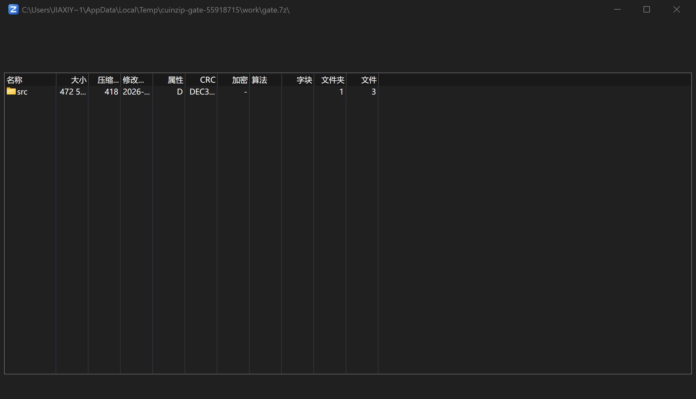
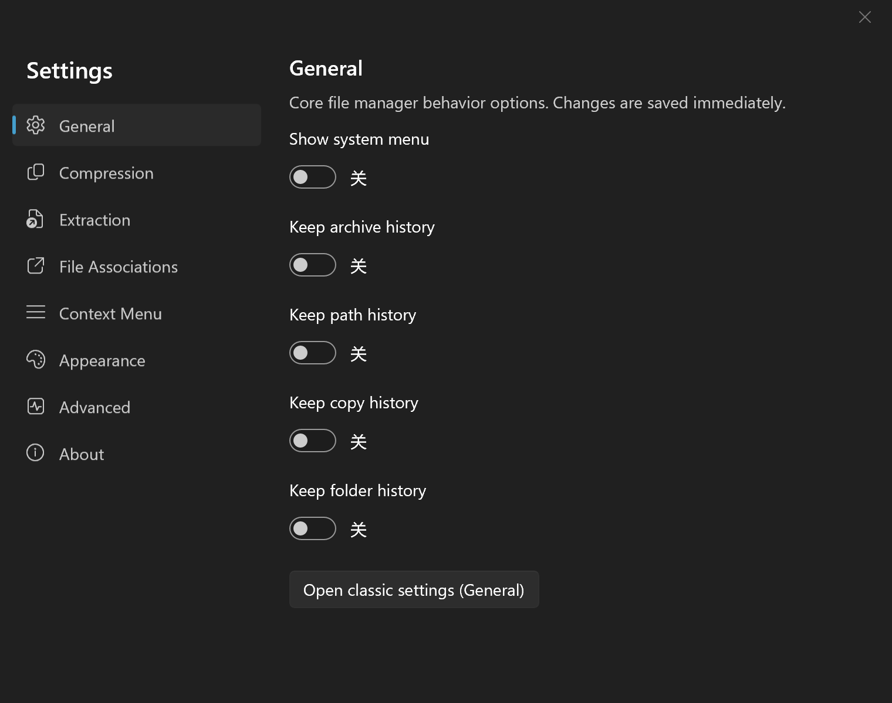
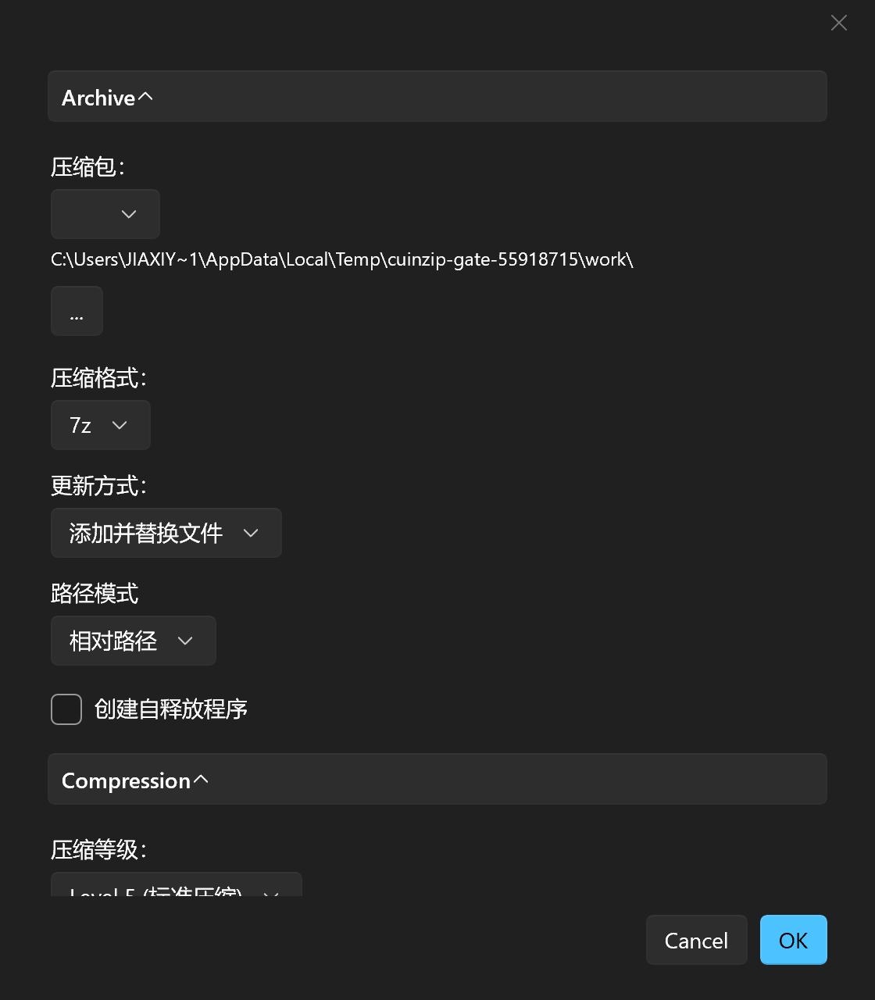

#  CuinZip

**CuinZip is a modern, open source file archiver for Windows — currently in
Preview / Alpha status (`v0.1.0-preview.2`).** It is a long-term derivative
project of [NanaZip](https://github.com/M2Team/NanaZip), which itself is forked
from the source code of the well-known open source file archiver
[7-Zip](https://www.7-zip.org).

**CuinZip is based on NanaZip and 7-Zip.** All credit for the original
architecture, compression implementations, and modern Windows integration
belongs to the NanaZip team (M2-Team, led by Kenji Mouri) and Igor Pavlov.

> **Unsigned Preview Build.** This preview release is not digitally signed.
> Windows SmartScreen may warn when you run the installer or the portable
> executable. No signing certificate or private key is distributed with this
> project.

## Features

Everything inherited from the NanaZip / 7-Zip baseline:

- All features from 7-Zip 26.03, [7-Zip ZS] and [7-Zip NSIS].
- Modern Windows 10/11 experience: MSIX packaging, dark mode, Mica effect,
  File Explorer context menu, Per-Monitor DPI awareness, and i18n support.
- Additional hash algorithms and codecs (Brotli, LZ4, Lizard, Zstandard, and
  more), plus additional security mitigations.
- The 7-Zip execution aliases (`7z.exe`, `7zFM.exe`, `7zG.exe`) and the `K7`
  alias family are preserved for compatibility.

Plus the CuinZip-specific work completed so far (see
[Docs/CUINZIP_PROGRESS.md](Docs/CUINZIP_PROGRESS.md) for the full plan):

- **Home and task shortcuts** — Open Archive, Create Archive, Extract Archive,
  and Browse Folder. The Create Archive page accepts both files and folders.
  A Home button returns you to these actions from the file manager.
- **Modern UI rework** — a context-aware toolbar, address bar with back/forward
  navigation, status bar with selection summary, empty states, and an Open
  Source Projects page.
- **Modern compression & extraction dialogs** — the classic 7-Zip dialogs are
  driven by a mirror engine and presented with a modern layout, with every
  original option preserved (formats, levels, dictionaries, split volumes,
  SFX, encryption, timestamps, and more).
- **Windows 11 Explorer integration** — a cascaded CuinZip submenu (default) or
  six flat verbs (Open with CuinZip, Extract Here, Extract to &lt;archive&gt;\,
  Add to archive…, Add to .7z, Add to .zip), plus SHA-256 and hash commands.
  Menu items are configurable in Settings and take effect on the next
  right-click.
- **Settings** — eight categories, all wired to the real configuration sources
  used by the dialogs and the shell extension (no second settings system).
- **File associations** — CuinZip reports the current default app for each
  archive extension and hands you to the official Windows Default Apps settings
  page; it never overrides your choice silently.
- **Original CuinZip iconography** — the app, SFX, and file-type icons are
  original works generated by `Assets/GenerateCuinZipAssets.py`.
- **Simple startup** — the portable ZIP includes a top-level `CuinZip.exe`
  launcher and a Chinese quick-start guide. The launcher explains missing
  files and Windows startup errors.

## Installation

中文用户请先阅读 [快速上手](Documents/QuickStart.zh-CN.md)。便携包完整解压后，
直接双击顶层 **CuinZip.exe**，再选择首页的打开、创建、解压或浏览文件夹操作。

Download the latest preview from the
[Releases page](https://github.com/yangxijia111/CuinZip/releases).

| Artifact | For |
| --- | --- |
| `CuinZip_<version>_x64_Portable.zip` | x64, no install — extract the complete ZIP, then run **CuinZip.exe** in the top folder. Keep the adjacent `x64` folder. The CLI is `x64/NanaZip.Universal.Console.exe`. |
| `CuinZip_<version>_x64_Setup.exe` | x64 per-user installer (no administrator rights required). Unsigned preview build. |
| `CuinZipPreview_<version>_x64_arm64.msixbundle` | MSIX package with full Windows 11 integration (context menu, file associations, tiles). Sideloading requires Developer Mode or a trusted certificate. |

Notes:

- The portable and installer builds run unpackaged: the Modern file manager and
  dialogs work, but the Explorer context menu is **not** available in this mode
  (it is delivered by the MSIX package).
- The installer registers CuinZip as a candidate in Windows Default apps and
  Open with. Your existing defaults stay selected. To choose CuinZip, open
  Windows Settings → Default apps, or the File Associations page inside
  CuinZip Settings. The portable build can be selected through Open with →
  Choose another app → browse to `CuinZip.exe`.

## Screenshots

Modern file manager, opening a .7z archive, Settings, and the compression
dialog (all captured from the portable x64 build):

| File manager | Opening a .7z archive |
| --- | --- |
|  |  |

| Settings | Compression dialog |
| --- | --- |
|  |  |

## Known Limitations

- **Unsigned preview build** — SmartScreen warnings are expected; verify the
  download against the published SHA-256 checksums.
- **MSIX sideloading** — the bundle is unsigned, so installing it on a normal
  system requires enabling Developer Mode. If you cannot or do not want to do
  that, use the portable ZIP or the installer; the Explorer context menu is
  only available through the MSIX package.
- **Preview status** — APIs, settings layouts, and menu structures may still
  change between preview builds.
- See [Docs/CUINZIP_PROGRESS.md](Docs/CUINZIP_PROGRESS.md) for the current
  phase plan and open issues.

## Building from Source

Requirements and the verified procedure are documented in
[Docs/CUINZIP_BASELINE.md](Docs/CUINZIP_BASELINE.md). In short: use Visual
Studio 2022 Build Tools with the UWP/MSIX components, map the repository to a
drive root with `subst` (non-ASCII paths break MIDL/mdmerge), run
`RestoreNuGetPackages.cmd`, then `BuildAllTargets.cmd`.

## License

CuinZip is distributed under the terms in [License.md](License.md). The
upstream NanaZip and 7-Zip licenses and copyright notices are preserved
unchanged. The CuinZip icons are original works created for this project and
do not derive from the NanaZip icons (which are licensed CC BY-ND 4.0 and are
not modified or redistributed by CuinZip).

[7-Zip ZS]: https://github.com/mcmilk/7-Zip-zstd
[7-Zip NSIS]: https://github.com/myfreeer/7z-build-nsis
